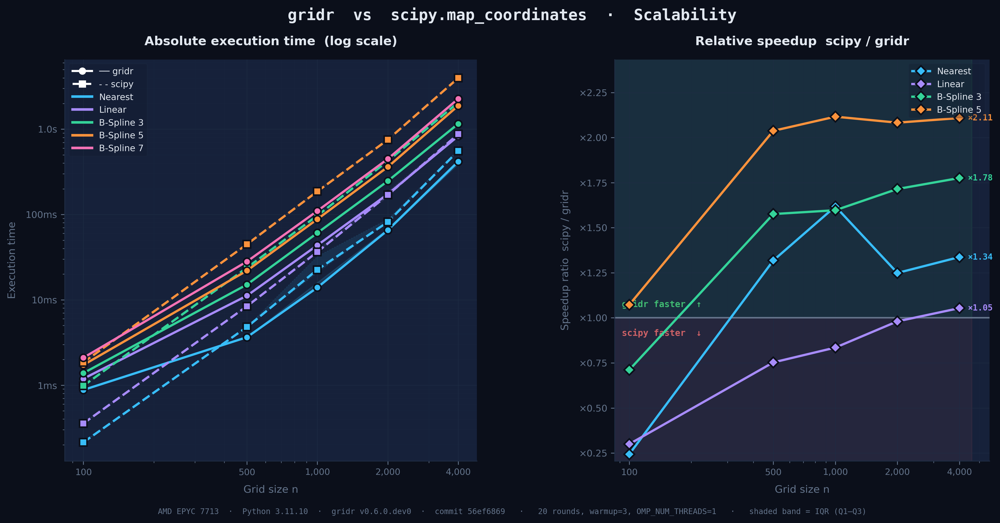

# GRIDR v0.6.0 — Release Notes

**Release date:** 2026-06-10  
**Type:** Performance Improvment Release

This release focuses on performance work that had been pending in the queue: a fast path for identity-resolution resampling, faster B-Spline kernels, a rewrite of the bounds-check logic in the separable convolution core, SIMD compilation flags enabled by default.

You will notice a **2 × – 4 × reduction in total computation time** for typical resampling workloads—varying with the interpolator and the grid size. At the same time, **GridR now outperforms SciPy on irregular‑grid interpolation tasks**, giving you faster results with the same API.




We also fixed the Docker `/dev/shm` issue several users reported, and exposed `trust_padding` as an explicit parameter instead of relying on an implicit default.

There are two breaking changes (`trust_padding` and `GridMetricsError` propagation) and one deprecation (`shmutils`). Migration is straightforward; see the migration section at the end.

---

## ⚡Performance

### AVX2 + FMA wheels on PyPI

PyPI wheels are now pre-compiled with AVX2 and FMA enabled. The gain is most visible on B-Spline prefiltering, cubic and B-Spline kernel evaluation, and large-grid workloads where the inner convolution loop dominates.

### Fast path for `(1, 1)` resampling

When `array_grid_resampling` is called with `grid_resolution=(1, 1)`  GridR now switches to a dedicated point-mesh code path that skips the full mesh interpolation machinery.

```python
result = array_grid_resampling(
    array_in=image,
    grid_row=grid_row,
    grid_col=grid_col,
    grid_resolution=(1, 1),   # fast path
    interp=interp,
    standalone=True,
)
```

### Safe-window masking

When a large region of your input is known to be fully valid (e.g. a small invalid border around a clean image), you can declare it as a "safe window" and skip per-sample mask checks inside that region.

```python
import numpy as np
from gridr.core.grid.grid_resampling import array_grid_resampling

# Image is 50×60, invalid patch at rows 4-30 cols 13-23.
# Rows 30-49 cols 23-59 are entirely valid.
result = array_grid_resampling(
    array_in=image,
    array_in_mask=mask,
    array_in_mask_safe_win=np.asarray([(30, 49), (23, 59)]),
    grid_row=grid_row,
    grid_col=grid_col,
    grid_resolution=(1, 1),
    interp=interp,
    standalone=True,
)
```

GridR trusts the declaration. If you mark a region as safe but it actually contains invalid samples, the output in that area will be wrong — there's no runtime verification. Use this only when you have an upstream guarantee.

The safe window is automatically eroded during B-Spline prefiltering by the kernel's influence radius. You don't need to adjust it when switching interpolation methods.

### Faster B-Spline kernels

All kernel weights are now computed in a single call with shared computations, instead of being computed individually. Applies to orders 3, 5, 7, 9, and 11.

### Two-stage short-circuit on mask validation

Mask validation inside the interpolation core has been reordered to test the most probable case first (kernel fully inside a valid region). The expensive per-sample weight test is now only invoked when the cheap one is inconclusive.

### Unchecked indexing on the fast inner-loop path

By default Rust checks that every array index is inside the array’s limits. In the convolution routine and the mask‑validation step we already know—through formal proof—that the indices we use can never be out of range. For these specific sections we have switched to “unchecked” mode, turning off the automatic bounds checks. This removes a small runtime overhead and speeds up the processing, while still remaining safe because the code guarantees the indices are valid.

### Benchmarking framework

`pytest-benchmark` is now wired into the test tree. Machine config is captured automatically so results are reproducible across runs.

```bash
# Core method vs scipy
pytest tests/python/benchmarks/time/test_time_core_array_grid_resampling.py

# Chain method vs CNES ORION (needs ORION_BIN_PATH)
export ORION_BIN_PATH=/path/to/orion
pytest tests/python/benchmarks/time/test_time_chain_array_grid_resampling.py
```

| Suite | Benchmarks | Reference |
|-------|------------|-----------|
| `test_time_core_array_grid_resampling` | `array_grid_resampling` | `scipy.ndimage.map_coordinates` |
| `test_time_chain_array_grid_resampling` | `basic_grid_resampling_chain` | CNES ORION (proprietary) |

---

## Docker-friendly shared memory

Several users hit a crash when running chains in Docker, caused by the default 64 MB cap on `/dev/shm`. Until v0.5.x, chain workers always allocated through POSIX named shared memory under `/dev/shm`, which silently limited what they could allocate.

v0.6.0 replaces that with a `SharedArray` facade backed by one of three interchangeable backends:

| Backend | Storage | Uses `/dev/shm` | Suitable for |
|---------|---------|-----------------|--------------|
| `shm` | Named POSIX SHM | yes | Workstations, sized `/dev/shm` |
| `mmap` | Anonymous mapping | no | Docker with default `/dev/shm` |
| `memfd` | Anonymous fd (Linux) | no | `fork` and `spawn` (Python 3.14+) |

Auto-detection picks the right backend based on `/dev/shm` availability and your `multiprocessing` start method. Existing chain code keeps working unchanged.

**Fix for Docker users**, two options:

```bash
# Option A: keep /dev/shm but raise the size
docker run --shm-size=2g my-gridr-image

# Option B: switch to mmap and drop the /dev/shm dependency entirely
docker run -e GRIDR_SHARED_MEMORY_BACKEND=mmap my-gridr-image
```

Option B is preferable when the container memory budget is tight, since `mmap` counts buffer bytes in the process RSS rather than the `tmpfs` quota.

**Scope:** this affects chain workers only. Direct API calls (Rust bindings, in-memory numpy) read no environment variable and use no shared memory.

**Python 3.14 readiness:** anonymous `mmap` doesn't survive a `fork`-to-`spawn` transition (no transmissible handle). The `memfd` backend exists for that case — it shares anonymous memory via an inheritable file descriptor, compatible with both start methods. You don't need to do anything today.

See the `SharedArray` documentation and the environment variable catalog for backends.

---

## 🛡️ Stability fixes

### Degenerate grids no longer crash `array_grid_resampling`

When a grid is malformed (e.g. single-point grid, metrics can't be computed), `array_grid_resampling` now:

1. emits a `UserWarning`: *"Grid metrics cannot be computed. Check your input grid data"*
2. fills the output with `nodata_out`
3. marks the output mask as fully invalid

This matches the existing behaviour of `basic_grid_resampling_chain`.

### Input mask dimension check in `basic_grid_resampling_chain`

The input mask is now verified to share width and height with the input array. Previously, a mismatch surfaced as an opaque indexing error from the Rust call stack.

---

## 📚 Breaking changes

### `trust_padding` is now required when `boundary_condition` is set

In v0.5.0, providing `boundary_condition` silently meant "padded border is valid data". For most interpolators this was fine; for B-Spline it was already handled correctly under the hood, since prefiltering devalidates the padded border via influence-radius erosion.

v0.6.0 exposes that decision as `trust_padding`. It must be explicit whenever `boundary_condition` is set — there is no implicit default.

```python
# Before
array_grid_resampling(..., boundary_condition='reflect', standalone=True)

# After (drop-in equivalent of v0.5.x)
array_grid_resampling(
    ...,
    boundary_condition='reflect',
    trust_padding=True,
    standalone=True,
)
```

- `trust_padding=True` → padded border treated as valid; matches v0.5.x.
- `trust_padding=False` → padded border treated as invalid; useful when boundary samples shouldn't contribute to the result.

For B-Spline, prefiltering still erodes the trusted region by the kernel's influence radius regardless of this flag. So under identity transforms you'll see NODATA at corners — that's the prefilter, not a regression.

Applies to `array_grid_resampling`, `basic_grid_resampling_array`, and `basic_grid_resampling_chain`.

### `GridMetricsError` no longer propagates from `array_grid_resampling`

Code that caught `GridMetricsError` around `array_grid_resampling` will no longer see the exception. Migrate to the warning-based pattern (see *Stability fixes* above). `basic_grid_resampling_chain` is unaffected; it already had this contract.

---

## Deprecations

### `gridr.scaling.shmutils`

The `shmutils` module is deprecated and will be removed in a future release. Use `gridr.scaling.shared_array` instead. The legacy module still works but emits a `DeprecationWarning` on import.

Two renames:

- `SharedMemoryArray` → `SharedArray` (the old name remains as an alias)
- `create_and_register_sma` → `create_and_register`, which now appends `SharedArray` instances to the tracking list instead of name strings

```python
# Before
from gridr.scaling.shmutils import SharedMemoryArray, create_and_register_sma

register = []
sma = create_and_register_sma(shape, dtype, register, prefix="buf")
# register contains: ["1-buf-..."]

# After
from gridr.scaling.shared_array import SharedArray, create_and_register

register = []
sa = create_and_register(shape, dtype, register, prefix="buf")
# register contains the SharedArray instance
```

`SharedArray.clear_buffers` accepts both forms during the transition, but new code should use instances.

These modules are internal plumbing for the chain subsystem. Most users won't import from `shmutils` directly.

---

## 📖 Documentation

The user-guide documentation has been reorganized and broken into a series of shorter, self-contained notebook pages that work independently.

A new notebook walks through the standalone preprocessing pipeline: source extent computation, padding strategies per boundary condition, mask preparation (including safe-window logic), and B-Spline prefiltering with its effect on the safe window. Ships with a `grid_resampling_plot_utils.py` helper for adaptive matplotlib rendering.

Location: `notebooks/grid_resampling_core_standalone.ipynb`.

Two new reference pages were also added for the shared-memory subsystem: the `SharedArray` documentation, and a central catalog of environment variables with Docker / Kubernetes / systemd / GitLab CI recipes.

---

## 🔧 Migration

1. Add `trust_padding=True` wherever you use a boundary condition. This preserves the v0.5.x behaviour.

   ```python
   array_grid_resampling(
       ...,
       boundary_condition='reflect',
       trust_padding=True,
       standalone=True,
   )
   ```

2. *(Optional)* If you know your input is mostly valid, declare a safe window via `array_in_mask_safe_win`.

3. *(Optional)* Replace any `try/except GridMetricsError` around `array_grid_resampling` with the warning-based pattern.

4. *(Only if you import from `shmutils`)* Switch to `gridr.scaling.shared_array` to silence the deprecation warning.

5. *(Docker)* If you were raising `--shm-size`, keep doing it or switch to `GRIDR_SHARED_MEMORY_BACKEND=mmap`.

---

## Internals

Substantial Rust refactor. None of this changes the Python API:

- Const-generic separable convolution: `KROWS` and `KCOLS` are now compile-time parameters, enabling zero-cost specialization across the four convolution variants (masked/unmasked × bounds-checked/unchecked).
- `GxArrayViewInterpolatorCore` trait: B-Spline, bicubic, and linear interpolators now only implement `compute_weights`; kernel application is inherited.
- Unified mask strategy: the standalone and chain Python paths share a single `resolve_mask_strategy` function, guaranteeing identical mask decisions for identical inputs.

---

## 📦 Installation

```bash
pip install --upgrade gridr
```

Wheels are built with AVX2 + FMA. Requirements:

- Python ≥ 3.10
- PyO3 ≥ 0.27.2
- x86_64 with AVX2 and FMA (Intel Haswell / AMD Excavator and later, i.e. essentially anything from 2013 onwards)

For older CPUs or non-x86_64 platforms, build from source.

---

## Links

- Documentation: https://gridr.readthedocs.io/
- Issues: https://github.com/CNES/gridr/issues
- Discussions: https://github.com/CNES/gridr/discussions
